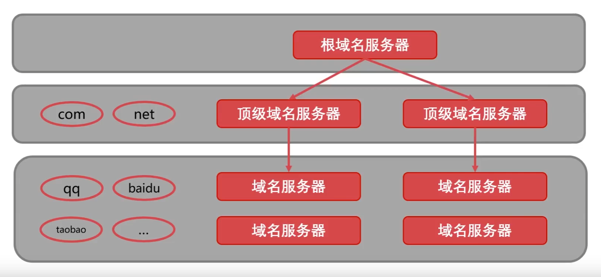

# 前言
计算机网络学习的核心就是网络协议的学习。那么什么是网络协议？

网络协议是为计算机网络中进行数据交换而建立的规则、标准的集合，是一种人为的约定。

比如说不同的计算机之间，很可能使用着不同的字符集，那么他们之间传输数据，就会出现问题。一个电脑上显示的“你好世界”，到另一个电脑上可能就变成了“烫烫烫”。所以传输数据，必须通过协议进行。

目前，互联网普遍使用TCP/IP协议

# OSI网络模型
以下是对模型的图文解释


在该模型的每一层中都会有一个专属协议，完成该层的工作，并向上下层传输数据。

接下来我们以OSI网络模型对计算机网络进行学习：
# 物理层
该层用来提供可靠的物理媒介用于稳定安全地传输原始数据
以下是物理层的各种设备：
## 中继器-物理层
中继器（RP repeater）是对信号进行再生和还原的网络设备。适用于完全相同的两类网络的互连，主要功能是通过对数据信号的重新发送或者转发，来扩大网络传输的距离。

## 集线器-物理层
集线器（HUB）就是将网线集中到一起的机器，也就是多台主机和设备的连接器。集线器的主要功能也有扩大网络的传输距离，他是中继器的一种形式。区别在于集线器能够提供多端口服务，所以也被称为多口中继器。
集线器的基本功能是信息分发，它把一个端口接收的所有信号向所有端口分发出去。一些集线器在分发之前将弱信号重新生成，一些集线器整理信号的时序以提供所有端口间的同步数据通信。

## 交换机-数据链路层
交换机(Switch) 也叫交换式集线器，是的，它是集线器的plus版。它通过对信息进行重新生成，并经过内部处理后转发至指定端口，具备自动寻址能力和交换作用。
由于交换机根据所传递信息包的目的地址，将每一信息包独立地从源端口送至目的端口，避免了和其他端口发生碰撞。
广义的交换机就是一种在通信系统中完成信息交换功能的设备。 

## 路由器-网络层
路由器(Router)是网络中进行网间连接的关键设备。作为不同网络之间互相连接的枢纽，路由器系统构成了基于 TCP/IP 的国际互连网络 Internet 的主体脉络。 
路由器的基本功能是，把数据（IP 报文）传送到正确的网络，细分则包括：

1.IP 数据报的转发，包括数据报的寻径和传送；
2.子网隔离，抑制广播风暴；
3.维护路由表，并与其它路由器交换路由信息，这是 IP 报文转发的基础；
4.IP 数据报的差错处理及简单的拥塞控制；
5.实现对 IP 数据报的过滤和记帐; 

# 数据链路层
数据链路层为上层在不可靠的物理介质上提供可靠的传输。
>物理层：我很可靠
>数据链路层：不，你不可靠，我才可靠

该层主要有以下几个作用：
- 物理地址寻址
- 数据的成帧
- 流量控制
- 数据的检错和重发

## 封装成帧
帧是该层的数据的基本单位，是一串数据。该层传输数据使用透明传输的原则，也就是控制字符和要传输的数据储存在同一个帧里面，但是在读取的时候会无视控制字符

## 如何检错
- 奇偶校验码：以二进制方式。统计帧里面有几个1，然后在头添加0或1进行标记，说明该帧有几个1。如果检查时发现不对，说明该帧数据出错
- 循环冗余检验码：根据传输或保存的数据而产生固定位数校验码。
## 最大传输单位MTU
最大传输单位(Maximum Transmission Unit)，这是用来确定帧的大小的，取决于具体的物理设备。相当于物理设备是公路，公路多宽就是MTU。显然，当传输时看最窄的那个，也就是取最小的MTU作为整个数据链路层的MTU。

## 以太网协议
这个协议就是数据链路层所使用的协议，我们来看该协议下的数据帧大概长什么样：

- 类型：用来标识上层使用的是什么协议
- 目的地址和源地址：使用MAC地址
- 数据：使用上层协议封装起来的数据
- CRC：循环冗余码
- 最短的帧：以太网规定最短帧应该是64节 
### MAC地址
是一组长为6字节的数。MAC地址要求每个网络适配器都必须有唯一的MAC地址（唯一性）

MAC广播地址：FF-FF-FF-FF-FF-FF

# 网络层
网络层的目的是实现两个端系统之间的数据透明传送。

网络层的功能包括寻址和路由选择、连接的建立、保持和终止等。此外，网络层还可以实现拥塞控制、网际互连等功能；

网络层中包含了众多协议且非常重要，其中最重要的协议就是IP协议

网络层的基本数据单位为IP数据段

几个重要协议：
- IP协议（Internet Protocol，因特网互联协议）;
- ICMP协议（Internet Control Message Protocol，因特网控制报文协议）;
- ARP协议（Address Resolution Protocol，地址解析协议）;
- RARP协议（Reverse Address Resolution Protocol，逆地址解析协议）。

## IP协议讲解
IP协议有什么意义：IP协议使得复杂的实际网络变为一个虚拟互联的网络；并且解决了在虚拟网络中数据报传输路径的问题。
### IP数据报
它是怎么做到的，看一下IP数据报的首部（首部后面跟着要传输的数据，因为放在前面，就叫首部）就可以明白大概的实现原理了
|位      |4   |   8 |  16 | 19 |   24 |31   |
|:----: | :-: | :-: | :-: | :-: | :-: | :-: |
|4字节  |版本 |首部长度|区分服务|总长度|总长度|总长度|
|8字节|标识  |标识    | 标识   |标志  |片偏移|片偏移|
|12字节|生存时间|生存时间|协议|首部检查和|首部检查和|首部检查和|
|16字节|源地址|源地址|源地址|源地址|源地址|源地址|
|20字节|目的地址|目的地址|目的地址|目的地址|目的地址|目的地址|
|更多字节|填充的内容|看情况填充|填充|填充|填充|填充|

显然IP数据报最小必须要有20个字节的首部。

### IP地址
只需要给现实中的每个主机分配唯一的IP地址就可以构筑一个虚拟网络，通过IP地址来找到真实的主机

IP地址分为网络号码和主机号码两个部分，同一个物理网络下的所有主机的网络号码一定是一样的，那么什么是网络号码和主机号码，让我们看一下IP地址的分类就可以了。


|类别|	IP范围|	子网掩码|	描述|
| :-: | :-: | :-: | :-: |
|A类（1~126）|1.0.0.1 ~ 127.255.255.254|	255.0.0.0|共有126个网络，每个网络可以有1600万台主机，适合大规模的网络|
|B类（128~191）|128.0.0.1 ~ 191.255.255.254|255.255.0.0	|共有16384个网络，每个网络可以有6万台主机，适合中等规模的网络|
|C类（192~223）|192.0.0.1 ~ 233.255.255.254	|255.255.255.0|共有209万个网络，每个网络可以有254台主机，适合小型网络|
|D类（224~239）|224.0.0.0 ~ 239.255.255.255| 	|组播地址|
|E类（240~255）|240.0.0.0 ~ 255.255.255.254|	 |保留地址|

这里面又牵扯到一个问题，什么是子网掩码。
实际上，随着网络的发展，上面的IP地址划分实在是浪费空间。因为前面几个数是固定用来表示IP地址类型的，这意味着IP地址不是纯粹放置着网络号和主机号。

在这样一种情况下，子网掩码诞生了。子网掩码用来在二进制下标识一组IP地址中哪个是网络号，哪个是主机号。所以才有了表中A类地址的掩码是255.0.0.0
因为在二进制下我们看子网掩码和IP地址：
```cpp
//子网掩码
11111111 00000000 00000000 00000000 
//IP地址
00000001 00000000 00000000 00000001
```
只要将子网掩码与IP地址进行按位与操作，就可以得到IP地址中的网络号，而且完美满足了A类地址要求的前8位是网络号的要求。所以A类地址的子网掩码是255.0.0.0.以此类推，B类C类的掩码也是一样的道理

### 私有IP地址
IP地址也分私有和公有，私有用于内部使用，只有公有是可以获得和申请的。
以下是所有私有地址：
A类 10.0.0.0–10.255.255.255，1个

B类 172.16.0.0–172.31.255.255，16个

C类 192.168.0.0–192.168.255.255，255个
>特殊地址除外，它就是不允许获取


## NAT技术
为什么会有外网和内网的说法，这一说法的来源就是NAT技术。

根据NAT技术，给企业或家庭所使用局域网下的所有主机的IP地址，都是私有网络。当它们想要访问互联网时，只能通过一个公有IP地址来连接互联网。而公有IP是由运营商维护的。

NAT技术在网关这个设备上实现。私有地址访问互联网时，会先在网关中将私有IP对应到一个公有IP上。注意，目标地址是不变的，变化的是源地址。

也就是说，当你想访问百度时，你的数据会经历以下步骤
1. 在网关处将源地址从私有地址改变为公有地址。
2. 根据目标地址进行发送。
3. 百度服务器接收数据并处理，返回数据的目标地址是原来的源地址。
4. 网关接收到了返回的数据，并将目标地址从公有地址改变为私有地址。
5. 网关根据私有地址将数据发送到你的电脑上。

这里最关键的技术就是该怎么将私有地址转换为公有地址。与之对应的有静态NAT、动态NAT、NATP、Easy IP、Server-NAT 。

- 静态NAT，顾名思义，一个私有地址对应一个公有地址，不会改变
- 动态NAT，网关会动态分配私有地址对应的公有地址，当私有地址长时间不访问时，就认为不需要，解除映射
- NATP，多个私有地址会映射到同一个公有地址下的不同端口，大大提升利用率
- Easy IP，将私有地址分配到网关的不同端口上，和NATP有点像。
- Server-NAT，让公网能够连接到私有地址对应的主机，让你的电脑也能成为服务器并被互联网连接。

## ARP/RARP协议
用来将IP地址和MAC地址进行关联，也就是说，它是用来给网络层和数据链路层沟通的工具。没有了它，网络层和数据链路层互相无法交换数据。
- ARP为网卡（网络适配器）的IP地址到对应的硬件地址提供动态映射，也就是从网络层到数据链路层。
- RARP指逆地址解析协议，可以把数据链路层MAC48位地址转化为网络层32位地址。也就是从数据链路层到网络层。
>通常ARP是即插即用，管理员不需要关注ARP表是如何将IP地址和MAC地址关联（这都要关注那也太浪费时间了）
## ICMP协议


和数据链路层用来查错的套路一样，在真正要传输的数据前加一串东西用来报告错误信息或者异常情况

注意，它记录的是传输过程中遇到的各种错误信息，所以可以通过它追溯传输路径和排查bug。

## 网络层如何路由
这里会说到Dij算法，是的。我们需要找到一种路由算法来确定数据传输时要怎么走。

### 内部网关-RIP协议
路由信息协议 RIP(Routing Information Protocol)，基于距离-向量的路由选择算法，较小的AS（自治系统），适合小型网络；RIP报文，封装进UDP数据报。

RIP协议特性：

- RIP在度量路径时采用的是跳数（每个路由器维护自身到其他每个路由器的距离记录）；
- RIP的费用定义在源路由器和目的子网之间；
- RIP被限制的网络直径不超过15跳；
- 和隔壁交换所有的信息，30主动一次（广播）。

### 内部网关-OSPF协议

开放最短路径优先协议 OSPF(Open Shortest Path First)，基于链路状态的路由选择算法（即Dijkstra算法），较大规模的AS ，适合大型网络，直接封装在IP数据报传输。

OSPF协议优点：

- 安全；
- 支持多条相同费用路径；
- 支持区别化费用度量；
- 支持单播路由和多播路由；
- 分层路由。
### OSPF与RIP比较


### 外部网关-BGP
BGP（Border Gateway Protocol）边际网关协议：是运行在AS之间的一种协议,寻找一条好路由：首次交换全部信息，以后只交换变化的部分,BGP会封装进TCP报文段.

# 传输层
传输层可以说是整个计算机网络中最重要的层级，它提供了应用间的通信。更高级的层级不会关心传输层之下的层级的细节，它们仅通过传输层来进行互相通信。

实际上可以理解为传输层进行了一次抽象，并为上层提供了接口，使用户不用再关注实际上是如何进行连接的，只需要通过传输层就可以进行稳定的连接和通信。

>与网络层不同，传输层是进程间的通信，网络层是主机与主机间的通信。

## 端口
在传输层中，根据TCP/IP协议，用一个16位端口号(0~65535)来标识一个端口，这些端口是一个计算机所能拥有的所有端口。

IP地址用来找到指定的主机/计算机，而端口用来找到指定的应用。不然数据传过来根本不知道应该给哪个软件。

注意，传输层的端口和硬件的端口是不一样的：
- 硬件端口，也就是设备间交互的接口，是物理意义上的端口，比如集线器，交换机等设备的接口；
- 软件端口，指的是应用层的的进程和传输层进行层间交互的一种地址，是逻辑意义上的端口，一般指的是TCP/IP协议中的端口。

端口分类：
- 公认端口：0~1023，明确与某种服务绑定，比如各种协议；
- 注册端口：1024~65535：松散的绑定一些服务，也就是有许多服务绑定这些端口。

一些常见的公认端口：
- TCP+20/21: ftp协议(文件传输协议)；
- TCP+22: ssh协议(专门为远程登录提供的安全性协议)
- TCP+25: SMTP协议(简单邮件传输协议)
- TCP/UDP+53: DNS协议(域名解析协议)
- TCP+80: Http协议(超文本传输协议)
- TCP+443: Https协议(超文本传输安全协议)

## TCP与UDP之前
TCP与UDP的区别在于一个是有连接服务，一个是无连接服务。

意思就是UDP就像写信，你写完直接发就完事了，根本不需要在意对方在不在线。但是TCP需要先连接，就像打电话，一定是要对方接了电话才能开始聊天。挂断电话就要结束。

## UDP协议
特点：
- 无需建立连接。与TCP不同的是，UDP不需要提前建立连接，这意味着UDP协议比TCP协议更快，因此- 对于一些对速度要求较高的应用（如DNS，网络音视频通话等）常常选用UDP协议。
- 传输不可靠。因为省去了建立连接的过程，UDP直接将数据发送到网络，所以无法保证传输的可靠性。
- UDP是面向报文的。应用程序交付的报文，UDP既不合并，也不拆分，直接添加首部以后交给网络层添加首部。（也就是将数据原封不动的发过去）
- 分组首部开销小。UDP首部只有8B，而TCP有20B的首部开销。
- 应用层可以控制发送时间和发送的数据。UDP没有拥塞控制，所以网络中的拥塞不影响主机发送效率。

UDP数据报：UDP首部+用户数据

UDP首部结构：
|16|32|
| :-: | :-: |
|16位源端口号|16位目的端口号|
|UDP长度|UDP校验和|

UDP数据报可以只有首部，没有数据。

## TCP协议
特点：
- TCP是面向连接的传输层协议。（要连接）
- TCP提供可靠交付服务，能保证数据有序、无差错、不重复且无丢失。（可靠性）
- 允许全双工通信，通信双方能够同时发送和接受数据。因此通信双方都有发送缓存和接收缓存。（一对一）
- TCP协议面向字节流。TCP协议将应用层传递下来的数据视为一串无结构的字节流。（TCP会把一整个数据切分开，一个一个地发送）

### TCP报文
首部结构：

- 源端口和目的端口2个字节
- 序号，TCP切割数据的一个特点，指的是数据部分第一个字节的编号。如果它是100，整个数据部分长100字节，那么下一个报文的序号就应该是201。
- 确认号，期望从对方接收到的数据的序号。
- 数据偏移，首部多长。
- 保留字段，用来给以后拓展的。
- TCP标记，很重要，下面讲。
- 窗口，用来告诉对面，我这边还有多少缓存空间，不要发太多信息，不然放不下。
- 校验和，用来校验数据。
- 紧急指针，用来告诉对方紧急信息多长。（紧急信息会放在所有数据的最前面）
- 可选
- 填充，保证首部是4字节的整数倍。

TCP标记：（很重要很重要很重要）
|标记|含义|
| :-: | :-: |
|URG|紧急位，为1时说明有紧急信息|
|ACK|确认位，TCP要求连接后，所有的ACK都要为1，否则报文是无效的|
|PSH|推送位，为1时要求立即推送给应用，不然所有的报文会在缓存满了以后才会推送过去|
|RST|复位位，为1时说明连接出现严重问题，需要释放当前连接重新建立|
|SYN|同步位，为1时表示这是连接请求或者连接接收报文|
|FIN|终止位，为1时表示传输完成，要断开连接|

## 三次握手
三次握手的含义：
- 第一次握手：客户发送请求，此时服务器知道客户能发；
- 第二次握手：服务器发送确认，此时客户知道服务器能发能收；
- 第三次握手：客户发送确认，此时服务器知道客户能收。

建立连接的过程：

第一次：客户向服务器发送连接请求段，建立连接请求控制段（SYN=1），表示传输的报文段的第一个数据字节的序列号是x（客户端随机的一个序号），此序列号代表整个报文段的序号（seq=x）；客户端进入 SYN_SEND （同步发送状态）；

第二次：服务器发回确认报文段，同意建立新连接的确认段（SYN=1），确认序号字段有效（ACK=1），服务器告诉客户端报文段序号是y（seq=y），表示服务器已经收到客户端序号为x的报文段，准备接受客户端序列号为x+1的报文段（ack_seq=x+1）；服务器由LISTEN进入SYN_RCVD （同步收到状态）;

第三次：客户对服务器的同一连接进行确认.确认序号字段有效(ACK=1),客户此次的报文段的序列号是x+1(seq=x+1),客户期望接受服务器序列号为y+1的报文段(ack_seq=y+1);当客户发送ack时，客户端进入ESTABLISHED 状态;当服务收到客户发送的ack后，也进入ESTABLISHED状态;第三次握手可携带数据;


## 四次握手
与建立连接对应的就是关闭连接，关闭连接通常是由客户机发出的。

第一次：客户向服务器发送释放连接报文段，发送端数据发送完毕，请求释放连接（FIN=1），传输的第一个数据字节的序号是x（seq=x）；客户端状态由ESTABLISHED进入FIN_WAIT_1（终止等待1状态）；

第二次：服务器向客户发送确认段，确认字号段有效（ACK=1），服务器传输的数据序号是y（seq=y），服务器期望接收客户数据序号为x+1（ack_seq=x+1）;服务器状态由ESTABLISHED进入CLOSE_WAIT（关闭等待）； 客户端收到ACK段后，由FIN_WAIT_1进入FIN_WAIT_2；

第三次:服务器向客户发送释放连接报文段，请求释放连接（FIN=1），确认字号段有效（ACK=1），表示服务器期望接收客户数据序号为x+1（ack_seq=x+1）;表示自己传输的第一个字节序号是y+1（seq=y+1）；服务器状态由CLOSE_WAIT 进入 LAST_ACK （最后确认状态）；

第四次：客户向服务器发送确认段，确认字号段有效（ACK=1），表示客户传输的数据序号是x+1（seq=x+1），表示客户期望接收服务器数据序号为y+1+1（ack_seq=y+1+1）；客户端状态由FIN_WAIT_2进入TIME_WAIT，等待2MSL时间，进入CLOSED状态；服务器在收到最后一次ACK后，由LAST_ACK进入CLOSED；

>等待时间是用来：确保所有报文都过期了，防止接收方没有收到报文，那个时候接收方会重新发送第三次的报文。


# 应用层
直接为用户服务，提供网络服务的接口。

到应用层，传输数据的基本单位是报文。

应用层有众多协议，包括：FTP（文件传送协议）、Telnet（远程登录协议）、DNS（域名解析协议）、SMTP（邮件传送协议），POP3协议（邮局协议），HTTP协议（Hyper Text Transfer Protocol）。

## DNS协议

域名管理系统，是为了解决IP地址复杂难记的问题。有了DNS，人们只需要输入好记的域名就可以访问指定的服务器，而域名到IP地址的转换接收DNS的内容。

### 域名结构
域名指的是用点符号分割的计算机名字。IP地址对应着网络上的各个机器，但由于IP地址没有具体字面含义，难以记忆，有时IP地址还会经常更换。引入域名来标识某台机器。

域名是一种树状结构树的最顶端代表根域名，下一层是 .com、.cn 等顶级域名，再下层就是二级、三级、四级域名

如图：


相对应的也有着各种域名服务器，如下：
- 根域名服务器：最高层次的域名服务器，根域名服务器知道所有顶级域名服务器的域名和IP地址。任何一个本地域名服务器要对互联网上的任何域名进行解析，只要自己无法解析，就会首先求助于根域名服务器。
- 顶级域名服务器：管理在该顶级域名服务器下注册的所有二级域名。当收到DNS查询请求时，就给出相应的回答（可能是最后的结果，也可能是下一步需要去找的域名服务器的IP地址）。
- 权限域名服务器（权威域名服务器）：负责一个区的域名服务器。当一个权威域名服务器不能给出最终的查询结果时，就会告诉发出请求方，下一步应该去找哪一个权威域名服务器。
- 本地域名服务器（递归服务器）：主机发出 DNS 查询请求时，该请求首先会发给本地域名服务器。

### DNS是如何工作的
1. 先在本地缓存里面找有没有映射
2. 在本地域名服务器里面找
3. 向根域名服务器发出解析请求，然后迭代解析，递归查询顶级域名服务器，权限域名服务器，一直到找到为止，然后在缓存里保存映射
4. 主机缓存映射，并访问IP地址

## HTTP/HTTPs
HTTP 是用于从万维网（WWW）服务器传输超文本到本地浏览器的传送协议，是基于 TCP/IP 协议之上的应用层协议。

特点：
- 简单快速，传输时只需要带上请求方式和路径，包括GET/HEAD/POST/DELETE/OPETION/PUT。http协议十分简单，使得对应的程序规模小而快。
- 灵活，http协议允许任意类型的数据对象，只需要用Content-Type 进行标记
- 无连接，每次连接都只处理一次请求，处理完并收到客户端的应答后立即端口。节省了时间
- 无状态保存，http协议不会记录前面的信息，如果后面需要，就要重新传，可能会导致每次传输的数据增大。
>为了解决这个问题，引入了Cookie技术。不过，随着http协议的发展，处理完请求后不会立即断开，而是会继续连接几秒，防止短时间内大量重复建立连接，节约了时间
- 支持B/S,C/S模式
>B/S就是只做一个服务器，客户只能通过游览器访问。C/S就是不仅要维护服务器端，还要做客户端

### HTTP工作流程
1. 连接到服务器
>用户确定要访问网页的URL，并将其输入到浏览器的地址栏中，浏览器向DNS服务器发出请求，获取Web服务器域名所对应的IP地址。HTTP 客户端通常就是浏览器，与 Web 服务器的 HTTP 端口（默认为 80）建立一个 TCP 套接字连接，比如http://www.abc.com；

2. 发送HTTP请求
>通过 TCP 套接字，客户端向 Web 服务器发送一个请求传输网页的 HTTP 请求报文，一个请求报文由请求行、请求头部、空行和请求数据 4 部分组成；

3. 服务器接收并返回响应
>Web 服务器解析请求，定位请求资源并将资源复本写到 TCP 套接字，由客户端读取。一个响应由 状态行、响应头部、空行和响应数据 4 部分组成；

4.  关闭TCP连接
>这个时候会查看 connection 模式，如果是close就会关闭，如果是keepalive，就会保持一段时间

5. 客户端解析HTTP请求


### HTTPs协议
和HTTP相比，增加了一层SSL加密协议，并不会影响原来的HTTP协议和IP协议的沟通，如图：

特点：
- 加密传播，在SSL握手时确定了会话密码，所有的信息都会借此加密
- 身份证书，客户端认证(可选的，大部分情况下没有)/服务器端认证(强制，一定有)，防止被冒充
- 校验机制，传输的信息中包括了校验检查，防止信息中途被篡改。

SSL握手过程


## TELNET协议
TELNET协议的功能：用户用 TELNET 就可在其所在地通过 TCP 连接注册（即登录）到远地的另一个主机上（使用主机名或 IP 地址）。

TELNET协议是基于TCP协议的一个B/S方式的远程终端协议


>用户所有的操作都会转化为NVT格式进行传输，服务器传输给用户端也是使用NVT格式

## FTP协议
文件传输协议，基于TCP协议，使用B/S方式
FTP协议会建立两个连接，一个是控制连接，一个是数据连接。

顾名思义，控制连接用于传输指令，数据连接用于传输文件。

1. 启动FTP服务器：由于FTP采用了客户机/服务器工作模式，因此在创建FTP会话之前，首先必须启动FTP服务器，并使其处于等待客户机程序的FTP请求状态。
2. 启动FTP客户机程序并建立控制连接：启动FTP客户机程序，并向FTP服务器的21端口（控制连接端口）发出主动连接的请求，以期获得FTP服务器的相应权限。服务器响应请求后便在用户协议解释器和服务器协议解释器之间建立了一条TCP连接。
3. 建立数据连接并进行文件传输：用户通过客户机程序输入FTP命令，服务器接收命令。如果命令正确且需要进行文件传输，服务器使用TCP20端口在双方之间建立另一条TCP连接，即数据连接，并通过该连接进行文件传输。当本次命令的文件传输完毕，关闭该数据连接。
4. 关闭FTP：用户执行完其所需的FTP命令后，发出退出FTP命令，控制连接关闭，本次FTP服务结束。
>所以数据连接只在需要的时候才会建立，但是控制连接不是

## 电子邮箱传输协议
一个完整的电子邮箱系统，由用户代理，邮箱服务器，和邮箱协议组成

用户代理，就是日常生活中常见的qq，163邮箱之类

用户编写邮件后会存放在邮件服务器，发送时根据目的邮箱地址从DNS查找对方的邮件服务器地址并发送，目的邮件服务器将邮件存储 。

以下是邮箱的整个工作流程

>注意，读取邮箱时也可以使用IMAP协议

### SMTP协议
使用25号端口
整个工作流程十分简单，建立连接，邮箱传输，连接释放
1. 建立连接：当需要发送时，主机会先向服务器发送建立连接的请求，得到服务器确认后会建立连接。之后主机会再次发送请求，确认服务器是否准备好接收邮件，如果服务器回复250确认码，表明服务器已经准备好了
2. 传输邮件：首先主机会发送MATL命令告诉服务器邮箱接收者的地址，如果服务器收到，需要返回250确认码，之后，主机将发送DATA命令告诉服务器，接下来将是邮件内容

### POP3
端口110，用于接收邮件

以前的POP3会在用户下载完邮件后，在服务器删除该邮件，现在则不会。

POP3会把邮件下载到本地，单方面的从服务器端读取邮件，你在本地对邮件的所有操作都不会被上传到服务器

### IMAP
端口143

与POP3不同，该协议下，邮件会与服务器保持同步，任何对邮件的操作都会同步到服务器。也就是说它建立了一个双向的通信，使服务器和客户端保持同步
